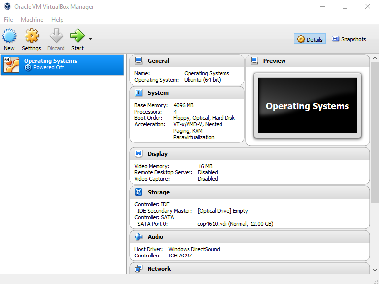
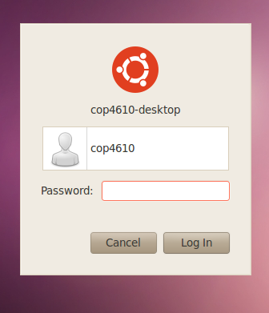
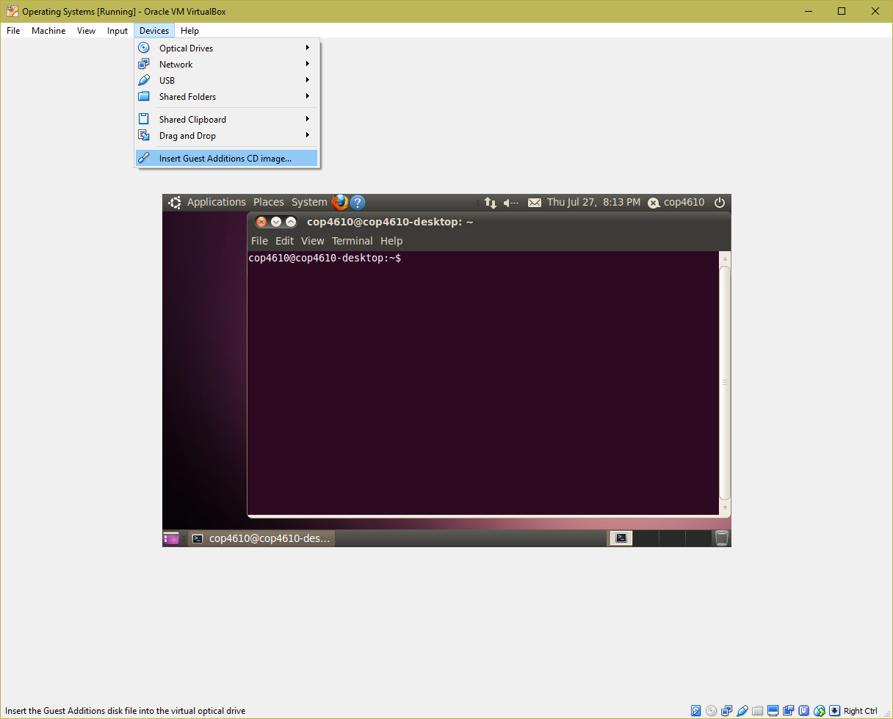

- Course [Syllabus](https://users.cs.fiu.edu/~fortega/fall16/cop4610/syllabus.html)

- [Download](https://www.virtualbox.org/wiki/VirtualBox) and install VirtualBox for your Operating System

- [Download](https://users.cs.fiu.edu/~fortega/storage/cop4610/cop4610.vdi) the image and save it in a sensible path. (Creating a folder for it usually works well).

## Loading the image in VirtualBox:
1. (After installation); open the VirtualBox application.
2. Click `New`
3. Type a sensible name (e.g.:"COP4610", "Operating Systems", "OS", "Covfefe")
4. Select `Linux` from the Type dropdown options
5. Select `Ubuntu` for version (64 or 32 bits according to your computer/laptop architecture)
6. Memory size depends on your machine. `1024` is a good rule of thumb; `2048` if you have memory to spare.
7. Check the `Use an existing virtual hard disk file` option. Click on the folder button to the right. Find the `cop4610.vdi` image you downloaded and click `Open`.
8. You should now have something like this:



Just select the image, and click `Start` to launch.

**Possible error for Windows 10 users:**

(Skip this step if no issues were encountered)

Upon clicking `start`, some users might get an error dialog box with the following message:

`VT-x is not available (VERR_VMX_NO_VMX).`

There are three common reasons for this error:

- Your CPU doesn't support VT-x or AMD-V virtualization
- VT-x or AMD-V is not enabled in BIOS (UEFI)
- You have Hyper-V virtualization enabled in Windows.

Follow this [link](http://druss.co/2015/06/fix-vt-x-is-not-available-verr_vmx_no_vmx-in-virtualbox/) for possible fixes.

## Running the image

Upon successful launch, your image will load and you will eventually end up with this:



- the default **user** is obviously: `cop4610-desktop`
- the default **password** is: `4610test`
- the default **HOST** key is: `right control` on **Win10** and `right command` on **OS X**

## Warnings / Error messages

This is a very old Linux release, so upon entering the correct password and accessing the desktop, it is likely you will be prompted with multiple Error / Warning dialog boxes with information such as:

- Version of ubuntu not supported anymore
- Software updates are available for this computer
- Metacity is not responding

Just ignore all warnings and close all windows and you should still be able to use the system.

## Running the system on fullscreen (guest additions):

As you might have noticed, this Ubuntu GUI is scaled down. Attempting to run it in Fullscreen (HOST+F) or Scaled mode (HOST+C) will not fix it, so do not bother trying it!

Instead, users have to install the Guest Additions CD Image.
This feature is bundled with VirtualBox, so just go on your VirtualBox toolbar:

`Virtual Box toolbar / Devices / Insert Guest Additions CD Image`



## Apt-get failures:
Attempting to install  packages from apt-get will fail.
i.e.

`$ sudo apt-get install git`

yields:
```
Package git is not available, but is referred to by another package.
This may mean that the package is missing, has been obsoleted, or
is only available from another source
E: Package git has no installation candidate
```
This happens because aptitude attempts to access a certain URL to find the package you are trying to download. This URL is deprecated and does not exist anymore.

You can fix it by changing your `/etc/apt/sources.list` file, by replacing old URL's.

Replace every instance of:

- `us.archive.ubuntu.com`
- `security.ubuntu.com`

for

- `old-releases.ubuntu.com`

and save it.

**If your sources.list already has old-releases.ubuntu.com, it means you downloaded the patched version of the .vdi, in which I took the liberty to change the sources.list so that you don't have to.**

Open your terminal and type:

`$ sudo apt-get update`

and aptitude should work!

you can test it by installing useful packages such as: `git` and `openSSH`

`$ sudo apt-get install git-core`

`$ sudo apt install openssh-server`

Reference: [link](https://help.ubuntu.com/lts/serverguide/openssh-server.html)

## Using Github and Snapshots:

Since you are going to be hacking this image's  Kernel in this course, any mistake will prevent your virtual machine from booting. If that is the case; **you will lose everything and will have to start from scratch.**

To avoid this nightmare from happening, I recommend using both **[Github](https://github.com)** and VirtualBox's **snapshots** feature.

When developing software, Github will help you version your system, keep track of your progress and allow you to rollback in case of mistakes.

Snapshots will basically create a safety copy of your virtual machine's state. I recommend taking a snapshot of the virtual machine right before recompiling the operating system. In case of failure, you will be able to roll back, hack again, and try to recompile once more. If your system recompiles and your hack proves successful, take a snapshot to save it and move on to the next assignment.

To take a snapshot 

## Accessing image from Terminal/Putty

If you installed OpenSSH Server, you will be able to terminal into your virtual machine via SSH. In order to do that, we need to portforward

## Virtualbox Portforwarding

## Bidirectional Clipboard 

## Making the image run faster (more cores)

## Recompiling the systems with -j (jobs) flag to make it faster.

## Do NOT increase the video memory to 64MB
(This will crash the system on boot)

useful link
https://www.virtualbox.org/manual/ch04.html